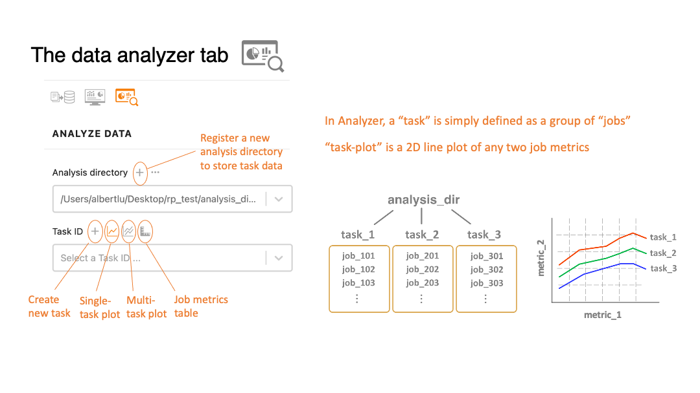
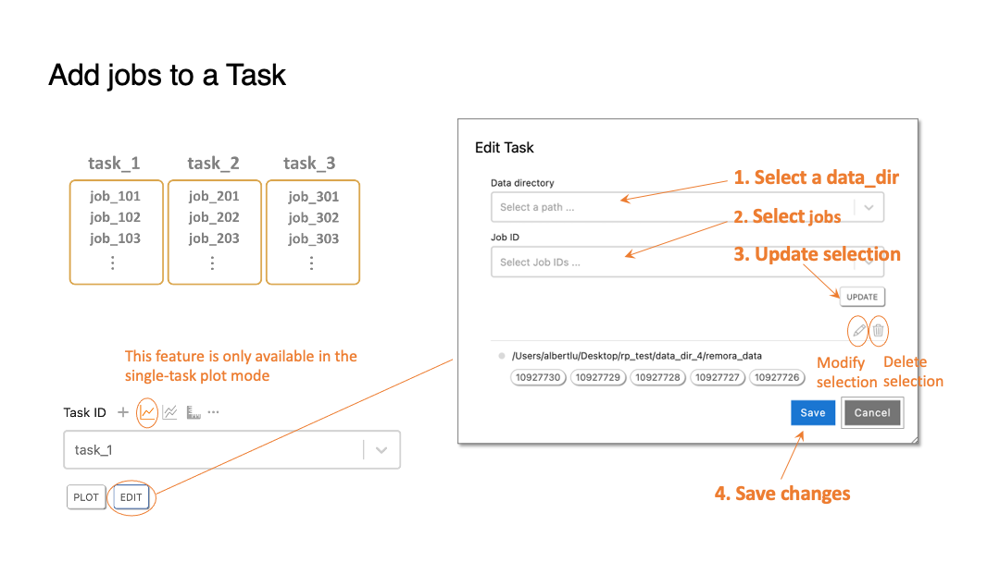
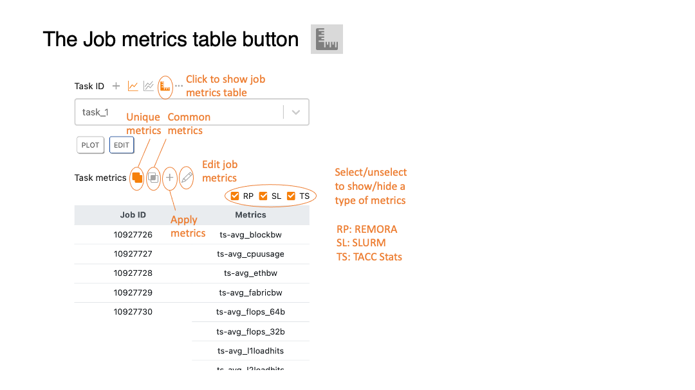
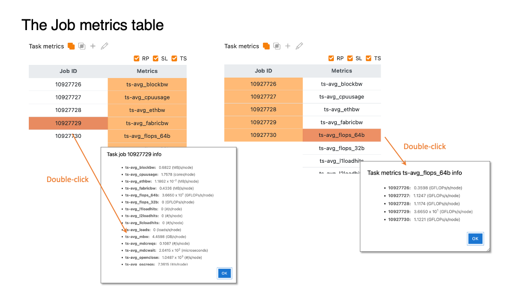
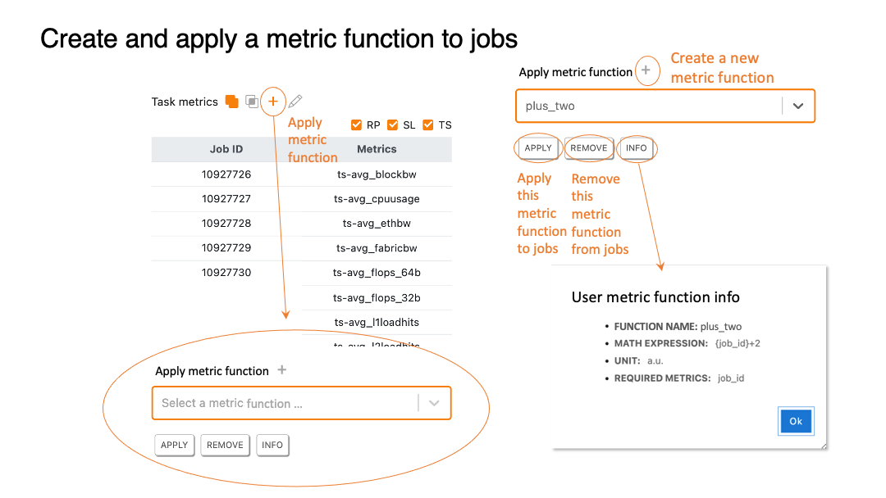
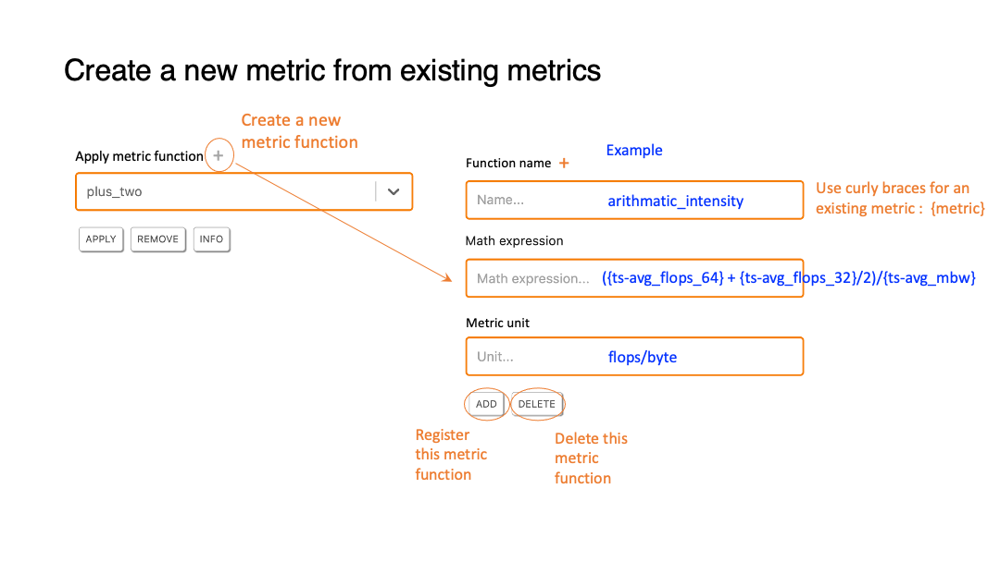
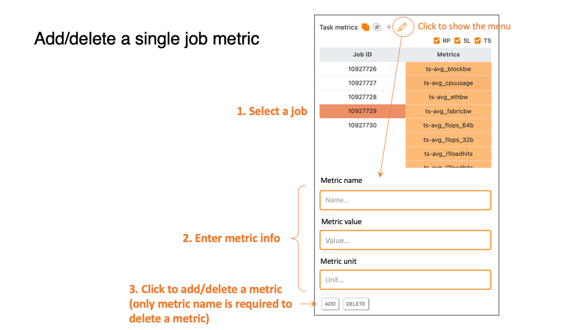
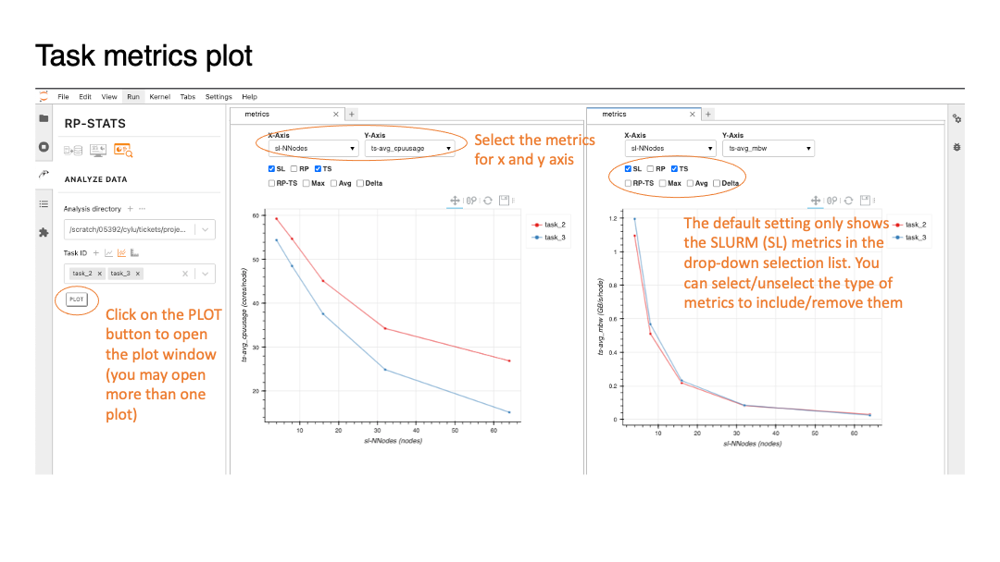

# Data analyzer 

### Table of Contents
>[The data analyzer tab](#analyzer_tab)  
>[Add jobs to a task](#add_jobs_to_task)  
>[The job metrics table button](#job_metrics_table_button)  
>[Job metrics table](#job_metrics_table)  
>[Apply metrics to selected jobs](#apply_metrics_to_jobs)  
>[Create new metrics](#create_new_metrics)  
>[Add/delete single job metrics](#add_delete_single_job_metrics)  
>[Task-metrics plot](#task_metrics_plot)  

[[Home]](../../user_guide.md)

[[Top]](#table_of_contents-analyzer)

[[Top]](#table_of_contents-analyzer)

[[Top]](#table_of_contents-analyzer)

[[Top]](#table_of_contents-analyzer)

[[Top]](#table_of_contents-analyzer)

[[Top]](#table_of_contents-analyzer)

[[Top]](#table_of_contents-analyzer)

[[Top]](#table_of_contents-analyzer)