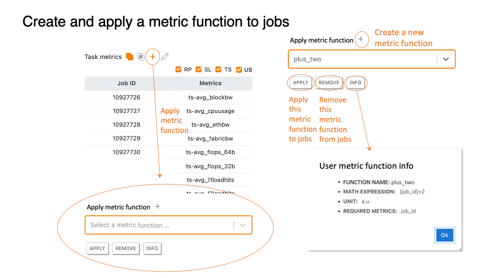

# Data analyzer 

### Table of Contents
>[The data analyzer tab](#slide42)  
>[Add jobs to a task](#slide43)  
>[The job metrics table button](#slide44)  
>[Job metrics table](#slide45)  
>[Apply metrics to selected jobs](#slide46)  
>[Create new metrics](#slide47)  
>[Add/delete single job metrics](#slide48)  
>[Task-metrics plot](#slide49)  

[[Main]](../../user_guide.md)
[[Basics]](./basics.md) 
[[Collector]](./collector.md) 
[[Visualizer]](./visualizer.md)

[[Top]](#table_of_contents-analyzer)

[[Top]](#table_of_contents-analyzer)

[[Top]](#table_of_contents-analyzer)

[[Top]](#table_of_contents-analyzer)

[[Top]](#table_of_contents-analyzer)

[[Top]](#table_of_contents-analyzer)

[[Top]](#table_of_contents-analyzer)

[[Top]](#table_of_contents-analyzer)