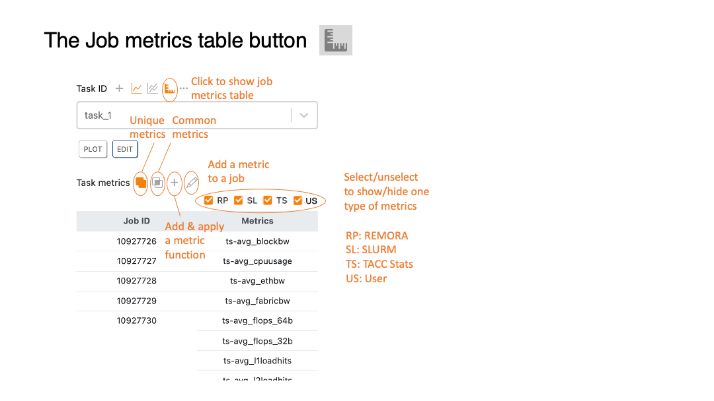

# Data analyzer 

### Table of Contents
>[The data analyzer tab](#slide42)  
>[Add jobs to a task](#slide43)  
>[The job metrics table button](#slide44)  
>[Job metrics table](#slide45)  
>[Apply metrics to selected jobs](#slide46)  
>[Create new metrics](#slide47)  
>[Add/delete single job metrics](#slide48)  
>[Task-metrics plot](#slide49)  

[[Main]](../../user_guide.md)
[[Basics]](./basics.md) 
[[Collector]](./collector.md) 
[[Visualizer]](./visualizer.md)

[DEMO] Add a new analysis directory 

 

[DEMO] Delete an analysis directory 

 

 

[[Top]](#table_of_contents-analyzer)

[DEMO] Add a new task 

 

[DEMO] Delete a task 

 

[DEMO] Update task 

 

[DEMO] Delete data directory and jobs in a task 

 

 

[[Top]](#table_of_contents-analyzer)

[[Top]](#table_of_contents-analyzer)

[DEMO] Job-metrics table 

 

[DEMO] Metric filter 

 

[DEMO] Unique and common metrics 

 

 

[[Top]](#table_of_contents-analyzer)

[[Top]](#table_of_contents-analyzer)

[DEMO] Add a new metric function 

 

[DEMO] Delete a metric function 

 

[DEMO] Show metric function information 

 

[DEMO] Remove function metric from jobs 

 

 

[[Top]](#table_of_contents-analyzer)

[DEMO] Add/delete a job metric 

 

 

[[Top]](#table_of_contents-analyzer)

[DEMO] Single-task plot 

 

[DEMO] Multiple-task plot 

 

[DEMO] Use metric filter in a task plot 

 

 

[[Top]](#table_of_contents-analyzer)