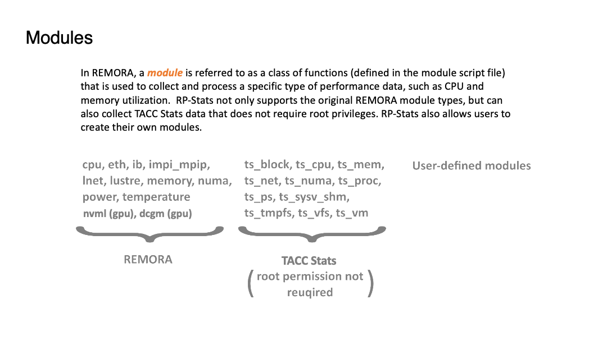

# Basics 

### Table of Contents
>[Start JupyterLab with RP-Stats on Frontera](#slide2)   
>[JupyterLab user interface](#slide3)   
>[Three basic modes](#slide4)   
>[RP data_dir directory](#slide5)  
>[RP modules](#slide6)  
>[Job metrics](#slide7)  
>[Ways to start data collection for a job](#slide9)  
>[Batch mode (RP wrapper script)](#slide10)  
>[Python mode (RP Python library)](#slide11)  

[[Main]](../../user_guide.md)
[[Basics]](./basics.md) 
[[Collector]](./collector.md)
[[Visualizer]](./visualizer.md)
[[Analyzer]](./analyzer.md)

[[Top]](#table_of_contents-basics)

[DEMO] Open RP-Stats panel

 

 

[[Top]](#table_of_contents-basics)

[[Top]](#table_of_contents-basics)

[[Top]](#table_of_contents-basics)

[[Top]](#table_of_contents-basics)

[[Top]](#table_of_contents-basics)

[[Top]](#table_of_contents-basics)

[[Top]](#table_of_contents-basics)

[[Top]](#table_of_contents-basics)

[[Top]](#table_of_contents-basics)

