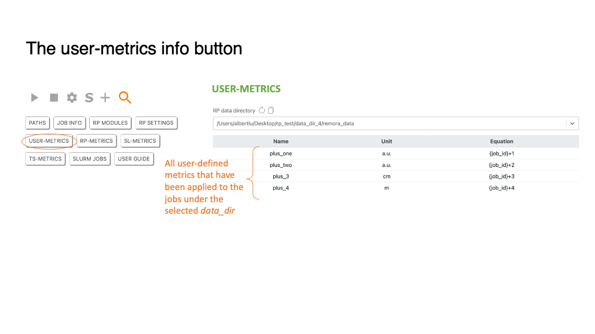

# Data collector 

### Table of Contents
>[The data collector tab](#slide12)  
>[Start data collection on a running job](#slide13)  
>[More control options for data collection](#slide14)  
>[Different approaches to start data collection in RP-Stats](#slide15)  
>[The setting button](#slide17)  
>[The SLURM mode button](#slide18)  
>[The add user-defined module button](#slide19)  
>[Load user-defined module file](#slide20)  
>[The Information button](#slide21)  
>[The paths and job info button](#slide22)  
>[The RP modules info button](#slide23)  
>[The RP settings info button](#slide24)  
>[The user-metrics info button](#slide25)  
>[The RP metrics info button](#slide26)  
>[The SLURM metrics info button](#slide27)  
>[The TACC Stats metrics info button](#slide28)  
>[The SLURM jobs status button](#slide29)  
>[The User guide button](#slide30)  

[[Main]](../../user_guide.md)
[[Visualizer]](../visualizer.md)
[[Analyzer]](../analyzer.md)

[[Top]](#table_of_contents-collector)

[[Top]](#table_of_contents-collector)

[[Top]](#table_of_contents-collector)

[[Top]](#table_of_contents-collector)

[[Top]](#table_of_contents-collector)

[[Top]](#table_of_contents-collector)

[[Top]](#table_of_contents-collector)

[[Top]](#table_of_contents-collector)

[[Top]](#table_of_contents-collector)

[[Top]](#table_of_contents-collector)

[[Top]](#table_of_contents-collector)

[[Top]](#table_of_contents-collector)

[[Top]](#table_of_contents-collector)

[[Top]](#table_of_contents-collector)

[[Top]](#table_of_contents-collector)

[[Top]](#table_of_contents-collector)

[[Top]](#table_of_contents-collector)

[[Top]](#table_of_contents-collector)

[[Top]](#table_of_contents-collector)

