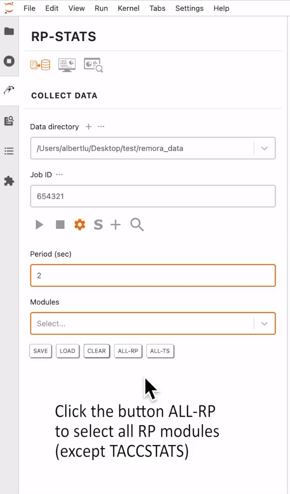

# Data collector 

### Table of Contents
>[The data collector tab](#slide12)  
>[Start data collection on a running job](#slide13)  
>[More control options for data collection](#slide14)  
>[Different approaches to start data collection in RP-Stats](#slide15)  
>[The setting button](#slide17)  
>[The SLURM mode button](#slide18)  
>[The add user-defined module button](#slide19)  
>[Load user-defined module file](#slide20)  
>[The Information button](#slide21)  
>[The paths and job info button](#slide22)  
>[The RP modules info button](#slide23)  
>[The RP settings info button](#slide24)  
>[The user-metrics info button](#slide25)  
>[The RP metrics info button](#slide26)  
>[The SLURM metrics info button](#slide27)  
>[The TACC Stats metrics info button](#slide28)  
>[The SLURM jobs status button](#slide29)  
>[The User guide button](#slide30)  

[[Main]](../../user_guide.md)
[[Basics]](./basics.md) 
[[Visualizer]](./visualizer.md)
[[Analyzer]](./analyzer.md)

[DEMO] Showing more options 

 

 

[[Top]](#table_of_contents-collector)

[DEMO] Start data collection (default) 

 

[DEMO] Stop data collection 

 

 

[[Top]](#table_of_contents-collector)

[DEMO] Default data collection without status monitoring 

 

 

[[Top]](#table_of_contents-collector)

[[Top]](#table_of_contents-collector)

[[Top]](#table_of_contents-collector)

[DEMO] Customize setting 

 

[DEMO] Save setting 

 

[DEMO] Load setting 

 

[DEMO] Remove setting 

 

[DEMO] ALL-RP, ALL-TS, and CLEAR button 

 

 

[[Top]](#table_of_contents-collector)

[DEMO] Data collection in SLURM mode 

 

[DEMO] Data collection in SLURM mode without job status monitoring 

 

[DEMO] Stop a SLURM job 

 

[DEMO] Customize SLURM options 

 

 

[[Top]](#table_of_contents-collector)

[DEMO] Test a user module 

 

[DEMO] Add a user module 

 

 

[[Top]](#table_of_contents-collector)

[DEMO] Load a user module file 

 

[DEMO] Delete a user module 

 

 

[[Top]](#table_of_contents-collector)

[[Top]](#table_of_contents-collector)

[DEMO] Info button: PATHS 

 

 

[[Top]](#table_of_contents-collector)

[DEMO] Info button: RP MODULES 

 

 

[[Top]](#table_of_contents-collector)

[DEMO] Info button: RP SETTINGS 

 

 

[[Top]](#table_of_contents-collector)

[DEMO] Info button: USER-METRICS 

 

 

[[Top]](#table_of_contents-collector)

[DEMO] Info button: RP-METRICS 

 

 

[[Top]](#table_of_contents-collector)

[DEMO] Info button: SL-METRICS 

 

 

[[Top]](#table_of_contents-collector)

[DEMO] Info button: TS-METRICS 

 

 

[[Top]](#table_of_contents-collector)

[DEMO] Info button: SLURM JOBS 

 

 

[[Top]](#table_of_contents-collector)

[[Top]](#table_of_contents-collector)

