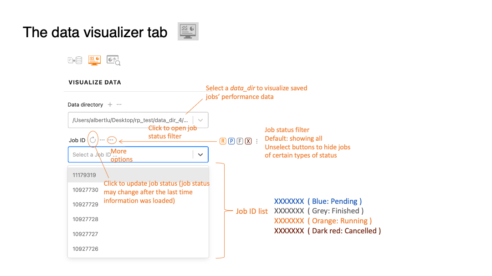
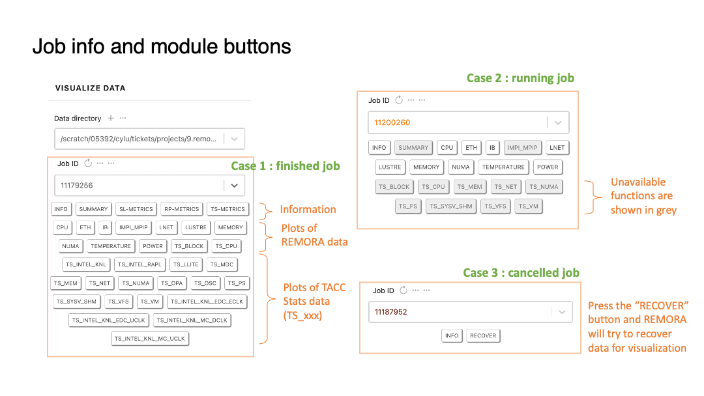
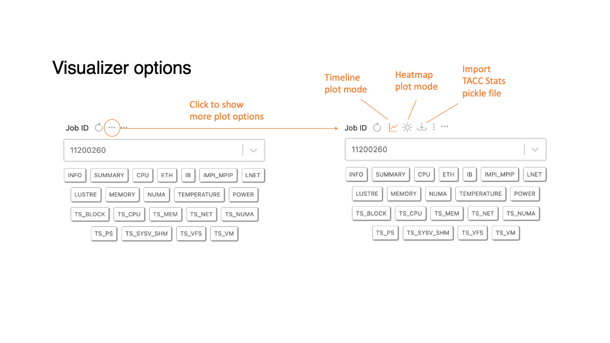
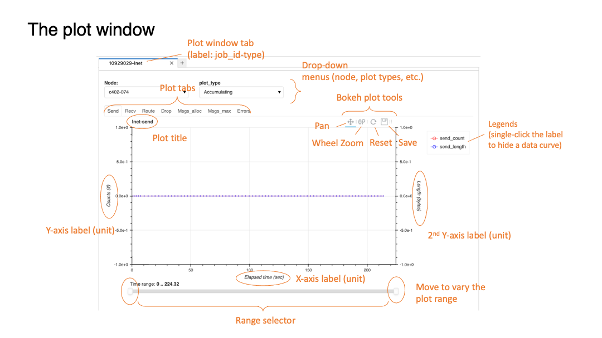
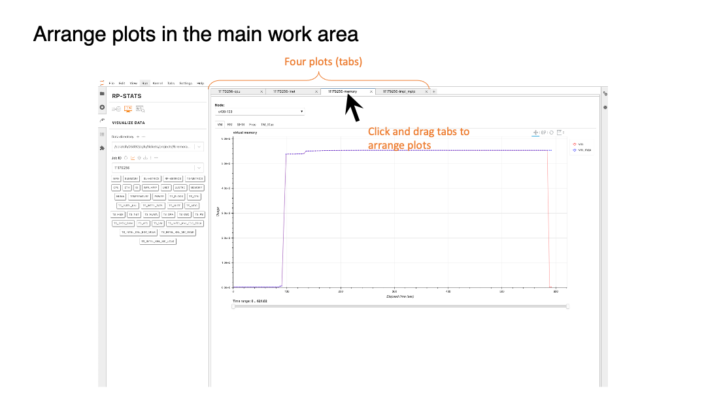
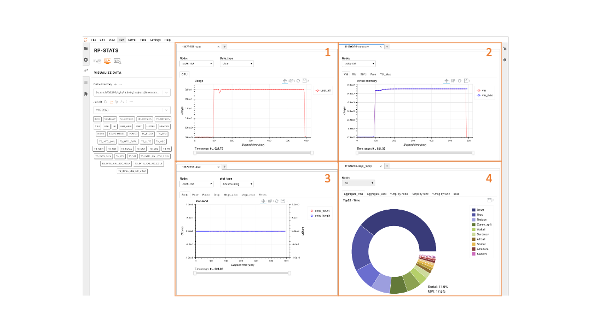
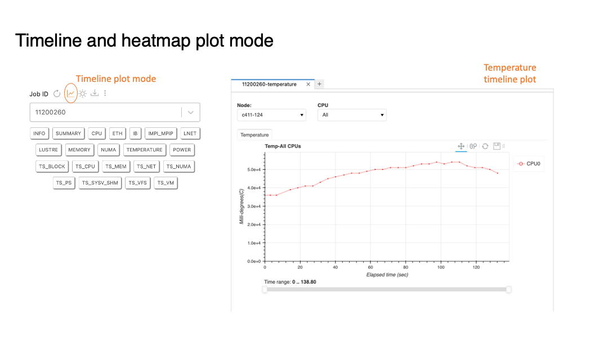
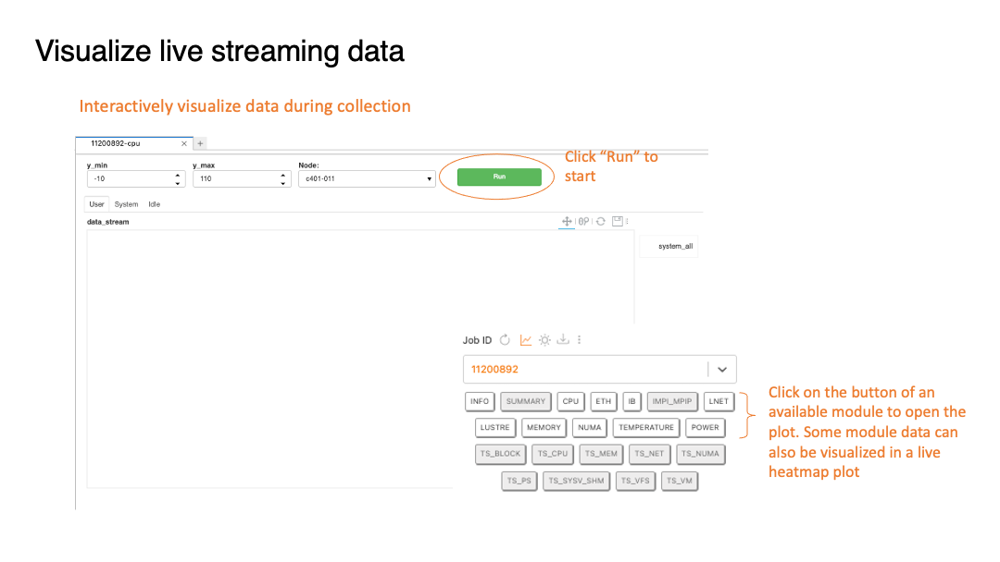
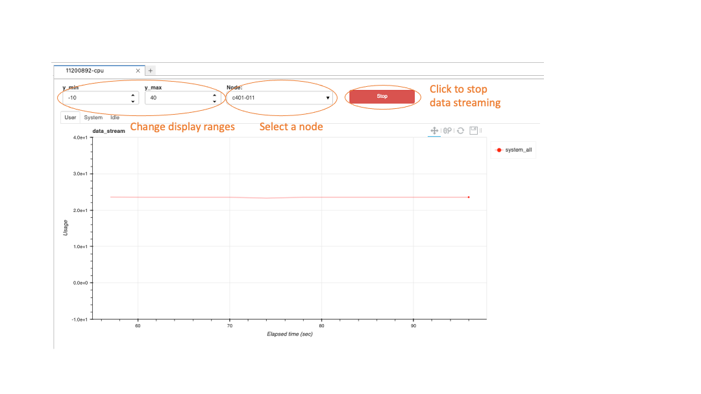
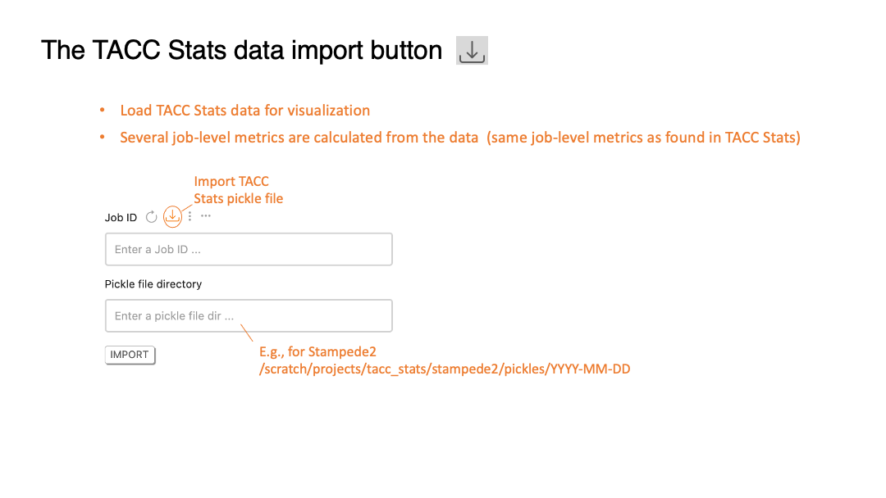

# Data visualizer 

### Table of Contents
>[The data visualizer tab](#slide31)  
>[Job info and module buttons](#slide32)  
>[Visualizer options](#slide33)  
>[The plot window](#slide34)  
>[Arrange plots in the main work area](#slide35)  
>[Timeline and heatmap plot](#slide37)  
>[Visualize live streaming data](#slide39)  
>[The TACC Stats data import button](#slide41)  

[[Main]](../../user_guide.md)
[[Basics]](./basics.md) 
[[Collector]](./collector.md) 
[[Analyzer]](./analyzer.md)

[[Top]](#table_of_contents-visualizer)

[[Top]](#table_of_contents-visualizer)

[[Top]](#table_of_contents-visualizer)

[[Top]](#table_of_contents-visualizer)

[[Top]](#table_of_contents-visualizer)

[[Top]](#table_of_contents-visualizer)

[[Top]](#table_of_contents-visualizer)

[[Top]](#table_of_contents-visualizer)

[[Top]](#table_of_contents-visualizer)

[[Top]](#table_of_contents-visualizer)

[[Top]](#table_of_contents-visualizer)