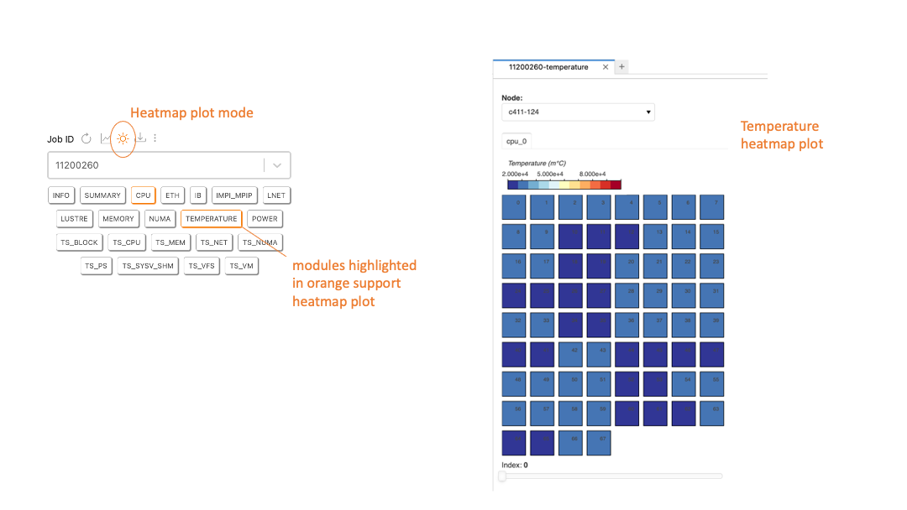

# Data visualizer 

### Table of Contents
* [The data visualizer tab](#slide31)
* [Job info and module buttons](#slide32)
* [Visualizer options](#slide33)
* [The plot window](#slide34)
* [Arrange plots in the main work area](#slide35)
* [Timeline and heatmap plot](#slide37)
* [Visualize live streaming data](#slide39)
* [The TACC Stats data import button](#slide41)  

[[Main]](../../user_guide.md)
[[Basics]](./basics.md) 
[[Collector]](./collector.md) 
[[Analyzer]](./analyzer.md)

[DEMO] Refresh job list 

 

[DEMO] Job status filter 

 

 

[[Top]](#table_of_contents-visualizer)

[DEMO] Job information buttons 

 

[DEMO] Job plot buttons 

 

[DEMO] Recover data from a canceled job 

 

 

[[Top]](#table_of_contents-visualizer)

[[Top]](#table_of_contents-visualizer)

[DEMO] Plot basics 

 

[DEMO] Range slider

 

[DEMO] Tooltip and hide data

 

[DEMO] Bokeh pan tool

 

[DEMO] Bokeh save tool

 

[DEMO] Bokeh wheel zoom tool

 

[DEMO] Bokeh y-wheel zoom tool

 

 

[[Top]](#table_of_contents-visualizer)

[[Top]](#table_of_contents-visualizer)

[DEMO] Arrange plots 

 

 

[[Top]](#table_of_contents-visualizer)

[[Top]](#table_of_contents-visualizer)

[DEMO] Heatmap plot mode 

 

[DEMO] Heatmap plot for streaming data 

 

 
 

[[Top]](#table_of_contents-visualizer)

[[Top]](#table_of_contents-visualizer)

[DEMO] Timeline plot for streaming data 

 

 

[[Top]](#table_of_contents-visualizer)

[DEMO] Import TACC Stats pickle file 

 

 

[[Top]](#table_of_contents-visualizer)